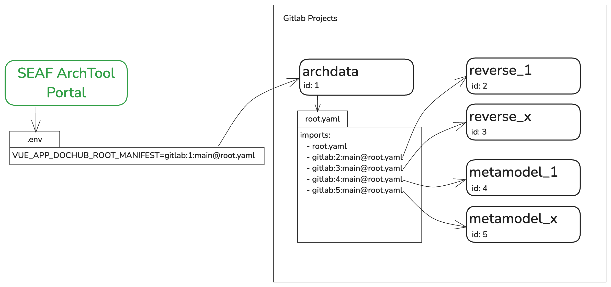

# Развертывание SEAF ArchPortal

В данном сценарии описывается развертывание портала SEAF вместе с Keycloak и Gitlab. Сценарий можно адаптировать под развертывание в промышленных средах.

## Все на одной машине

На одной машине будут развернуты контейнеры SEAF Archtool, PlantUML, Keycloak (postgres), Gitlab и Reverse-Proxy на NGINX.

| Контейнер     | Порты и протоколы            |
|---------------|------------------------------|
| seaf-backend  | tcp/8080                     |
| plantuml      | tcp/8079                     |
| keycloak      | tcp/8443, tcp/9000, tcp/8081 |
| gitlab        | tcp/8929, tcp/8083, tcp/2424 |
| reverse-proxy | tcp/80, tcp/443              |

**Развернуть все на одной машине** - [настроить](README_SINGLE_HOST.MD)

**Развернуть seaf-portal в Kubernetes** - [настроить](README_KUBER.MD)

## Для включения реверса инфраструктуры
Разверните контейнеры с AirFlow [по инструкции](mle-airflow/README.md)

Рекомендованная структура репозиториев


### Подготовка к развертыванию

1. Создайте FQDN для сервисов ниже и зарегистрируйте на вашем DNS сервере (можно ограничиться файлом /etc/hosts)

| Контейнер    | FQDN (пример)             |
|--------------|---------------------------|
| seaf-backend | archportal.local          |
| keycloak     | keycloak.archportal.local |
| gitlab       | git.archportal.local      |

2. Склонируйте данный репозиторий и инциализируйте сабмодули

```shell
git clone https://github.com/mtrhnv/seaf-portal.git

cd seaf-portal

git submodule init && git submodule update --recursive
```

3. Создайте и подпишите на вашем CA сертификаты для каждого FQDN.

Для тестового развертывания мы создадим самоподписанный wildcard сертификат для домена **archportal.local**

**Внимание!** Эти сертификаты не предназначены для использования в prod-средах и используются исключительно в ознакомительных целях.

**В консоли перейдите в корень клонированного репозитория!**

```shell
# Зададим наш домен
DOMAIN=archportal.local
# Создадим и перейдем в папку с сертификатами
mkdir certs
cd certs
# Создадим конфигурационный файл
cat > openssl.conf << EOF
[CA_default]
copy_extensions = copy

[req]
default_bits = 2048
prompt = no
default_md = sha256
distinguished_name = req_distinguished_name
x509_extensions = v3_ca

[req_distinguished_name]
C = RU
ST = Moscow
L = Moscow
O = Lazy Arch Inc
OU = IT
emailAddress = it@nowhere.earth
CN = $DOMAIN

[v3_ca]
basicConstraints = CA:FALSE
keyUsage = digitalSignature, keyEncipherment
subjectKeyIdentifier = hash
subjectAltName = @alternate_names

[alternate_names]
DNS.1 = $DOMAIN
DNS.2 = *.$DOMAIN
EOF
# Сгенерируем сертификаты
openssl req -x509 -newkey rsa:2048 -sha256 -utf8 -days 3650 -nodes \
    -config ./openssl.conf \
    -keyout ./server.key \
    -out ./server.crt

cd ..
mkdir reverse-proxy/certs
cp certs/server.crt certs/server.key reverse-proxy/certs
```

Теперь у нас есть сертификаты и можно поднимать наши сервисы.

4. Запускаем Reverse-Proxy

Перед запуском укажите корректные FQDN для ваших сервисов в файле ./reverse-proxy/env/nginx.env

``` shell
cd reverse-proxy
docker-compose up -d
cd ..
```

5. Запускаем Keycloak или настраиваем свой OpenID Identity Provider

Перед запуском укажите корректные FQDN для ваших сервисов в файле ./keycloak/env/keycloak.env

``` shell
cd keycloak
docker-compose up -d
cd ..
```

Далее необходимо настроить Keycloak для работы в нашей инсталляции по [инструкции](keycloak/README.MD)

Если вы используете ADFS, то настройка описана [здесь](keycloak/ADFS.MD)

6. Запускаем Gitlab

Откройте ./gitlab/docker-compose.yaml и укажите корректный external_url

``` shell
cd gitlab
docker-compose up -d
cd ..
```

Далее необходимо настроить Gitlab для работы в нашей инсталляции по [инструкции](gitlab/README.MD)

7. Запускаем SEAF ArchPortal

Перед запуском убедитесь в корректности параметров в **.env**

``` shell
docker-compose up -d
cd ..
```

Подробную **инструкцию по реализации ролевой модели** вы можете найти [здесь](ROLEMODEL.MD)

## Развертывание на разных машинах

Для развертывания на нескольких виртуальных машинах вам потребуется:

1. Cгенерировать сертификаты как в п.2 инструкции по развертыванию на одной машине
2. Скопировать весь пакет вместе с сгенерированными сертификатами на все машины
3. Запустить на каждой машине Reverse-Proxy и соответствующий сервис повторяя шаги [4,5], [4,6], [4,7]
4. Необходимо обеспечить сетевую доступность между виртуальными машинами и клиентами в соответствии с таблицей

| Src                      | Dst                            | Protocol/port   |
|--------------------------|--------------------------------|-----------------|
| Пользовательский сегмент | seaf-backend, keycloak, gitlab | tcp/80, tcp/443 |
| seaf-backend             | keycloak, gitlab               | tcp/443         |
