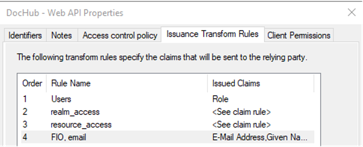

1. Создать группу в AD
      В AD создать группу и включить в нее необходимых пользователей.
2.	Проверить доступность конфигурации openid
      https://{{domain}}/adfs/.well-known/openid-configuration
      {{domain}} – заменить на домен ADFS
3.	Открыть консоль ADFS
      Start - Server Manager - Tools - AD FS Management

4.	Создать кастомный  claim
      Нужен для отображения ФИО в интерфейсе SEAF ArchTool после успешного входа в систему.
      AD FS – Service – Claim Descriptions – Add Claim Description
      •	Display name “name for SEAF ArchTool”
      •	Short Name “name”
      •	Claim type http://yyy.ru/name
      •	Включить 2 галки «Publish….”

5.	Создать Application Group
      Application Groups - Add Application Group:
      •	ввести название "SEAF ArchTool" в поле "Name"\
      •	выбрать template "Web broweser accessing a web application"
      •	в поле Redirect URI указать домен приложения SEAF ArchTool (например, https://archportal.local)
      •	в поле Police выбрать "Permit everyone"

6.	Настроить правила по добавлению claim в jwt-токен:
      •	открыть Application Group "SEAF ArchTool"
      •	выбрать "Web application" "SEAF ArchTool" и нажать "Edit..."
      •	открыть вкладку "Issuance Transform Rules"
      •	нажать кнопку "Add Rule..."
      Далее настроить последовательно 4 правила:

        Правило 1
        •	выбрать "Send Group Membership as a Claim"
        •	в поле “Claim rule name” указать значение «Users»
        •	в поле “User’s Group” выбрать группу из п.1
        •	в поле «Outgoing claim type” выбрать «Role»
        •	в поле «Outgoing claim value» добавить “users”

        Правило 2
        •	выбрать "Send Claims Using a Custom Rule"
        •	в поле “Claim rule name” указать значение «realm_access»
        •	в поле “Cusom rule” добавить значение:
        c:[Type == "http://schemas.microsoft.com/ws/2008/06/identity/claims/role", Value =~ "users"]
        => issue(Type = "realm_access", ValueType = "http://www.w3.org/2001/XMLSchema#json", Value = "{\x22roles\x22:[\x22" + c.Value + "\x22]}");

        Правило 3
        •	выбрать "Send Claims Using a Custom Rule"
        •	в поле “Claim rule name” указать значение «resource_access»
        •	в поле “Cusom rule” добавить значение:
        c:[Type == "http://schemas.microsoft.com/ws/2008/06/identity/claims/role"]
         => issue(Type = "resource_access", ValueType = "http://www.w3.org/2001/XMLSchema#json", Value = "{\x22archportal\x22:{\x22roles\x22:[\x22user\x22,\x22users\x22]},\x22account\x22:{\x22roles\x22:[\x22manage-account\x22,\x22manage-account-links\x22,\x22view-profile\x22]}}");

        
        Правило 4
        •	выбрать "Send LDAP Attributes as Claims"
        •	в поле “Claim rule name” указать значение «FIO, email»
        •	в поле “Attribute store” выбрать “Active Directory”
        •	в mapping полей заполнить в соответствии с картинкой

7.	Добавить scope

Во вкладке «Сlient Permissions» включить scope name:
•	Email
•	Openid
•	Profile

8.	Добавление доменов SEAF ArchTool в trusted origins

https://learn.microsoft.com/en-us/windows-server/identity/ad-fs/operations/customize-http-security-headers-ad-fs

Войти в PowerShell с правами администратора и выполнить команды

Set-AdfsResponseHeaders -EnableCORS $true
Set-AdfsResponseHeaders -CORSTrustedOrigins https://archportal.local (указать свой домен)
Get-AdfsResponseHeaders

9.	Выпустить сертификат безопасности для ADFS
      Библиотека в SEAF ArchTool не поддерживает формат сертификата безопасности, выпускаемый по умолчанию в ADFS.
      •	Сгенерировать сертификат в OpenSSL SHA256, 2024 bit RS256 в формате .pfx
      •	Загрузить сертификат в Personal на ВМ с ADFS
      •	Выполнить команду в PowerShell с правами администратора:
      Set-AdfsProperties -AutoCertificateRollover $false
      •	Добавить сертификат в консоль ADFS - Service - Ceriticates - Token-Signign
      •	Оснастка MMC - Ctrl+M - Personal Certificates - правой кнопкой мыши на новом сертификате
      Добавить пользователя srv_adfs на чтение к сертификату в Personal - All task - Manage Private Keys - Add - пользователь srv_adfs на чтение
      •	в консоль ADFS - Service - Ceriticates - Token-Signign установить set primary для нового сертификата
      •	Проверить новый сертификат
      https://{{domain}}/adfs/discovery/keys  
      {{domain}} – заменить на домен ADFS
10.	Добавить параметры в конфиг в SEAF ArchTool в соответсвующие переменные в файле ../.env

Значения из well-known/openid-configuration 
VUE_APP_DOCHUB_AUTHORITY_SERVER= точка входа  - issuer в ADFS (см. п.2)
VUE_APP_DOCHUB_AUTH_PUBLIC_KEY= точка входа - jwks_uri в ADFS (см. п. 9)

Значение из консоли ADFS:
VUE_APP_DOCHUB_AUTHORITY_CLIENT_ID= client_id в ADFS (см. п. 5)

