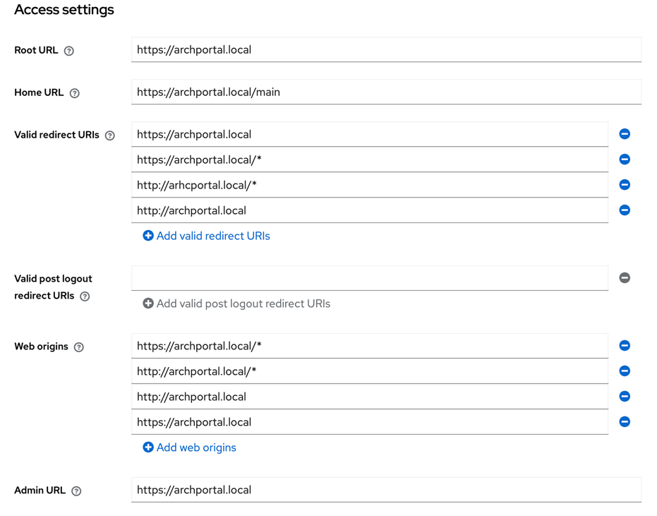
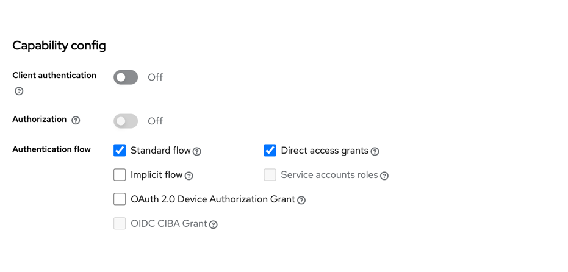

# Настройка realm и клиента

1. Войти в консоль Keycloak с дефолтным логином и паролем указанным в keycloak.env

2. Создайте realm который будет указан в переменной **VUE_APP_DOCHUB_AUTHORITY_SERVER=** в файле ./.env   
   В тестовом сценарии создается realm **archportal**, но можно использовать realm по-умолчанию (master)

   
   

3. Перейдите в раздел clients и создайте нового клиента.    
В данной конфигурации клиент также называется archportal и задается в переменной **VUE_APP_DOCHUB_AUTHORITY_CLIENT** в файле ./.env 

   
   
   
   

4. Перейдите в раздел Roles и создайте роль.   
Роли в SEAF портале задаются в файле ./seaf-backend/roles/roles.yaml, а подключаются в переменную **VUE_APP_DOCHUB_ROLES** в файле ./.env 

   
   

5. Далее создадим пользователя, добавим ему роль которую создали на шаге 4 и зададим пароль

   
   
   
   
   
   

6. Скопируем RSA ключ для подписи запросов. Для этого перейдем в раздел Realm Settings -> Keys и скопируем RS256 Public key

   

7. Скопированный ключ необходимо вставить между блоками   
-----BEGIN PUBLIC KEY-----{_ваш ключ_}-----END PUBLIC KEY----- в переменную **VUE_APP_DOCHUB_AUTH_PUBLIC_KEY** в файле ../.env 
8. Установите время жизни токена и сессии
 - Realm Settings -> Sessions -> SSO Session Idle (время жизни Refresh-токена)

 - Realm Settings -> Token -> Access token Lifespan (если оставить значение по-умолчанию то фронтенд будет непрерывно запрашивать обновление Access-токена)
